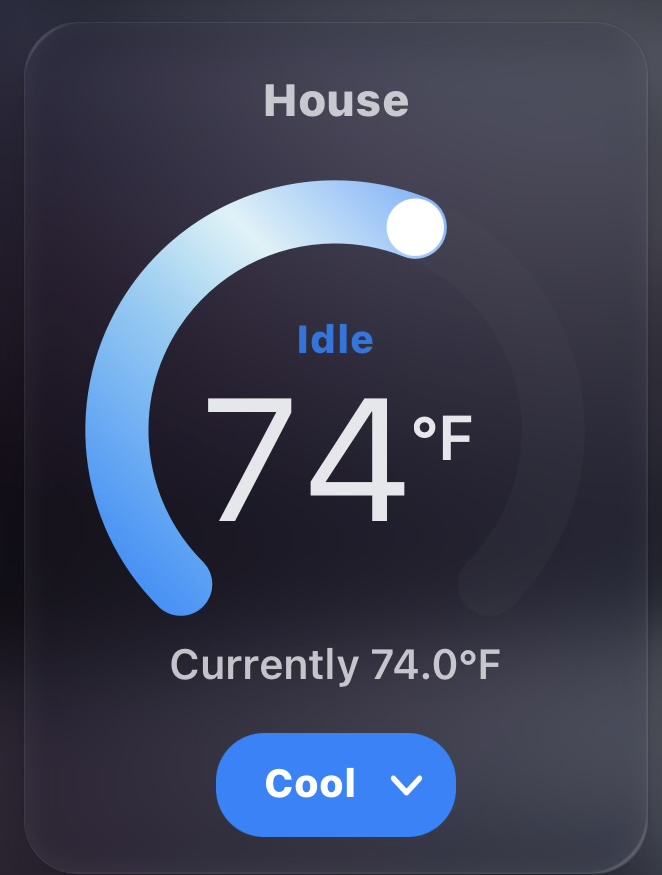

# Haptic Animated Cards

A suite of animated glass cards for Home Assistant with haptic feedback:
an iOS-style **thermostat dial**, **temperature pills** coloured by their
reading, and a **media controller** tinted by the playing app.

<p align="center">
  
</p>

You feel a tick for every degree you cross on the dial, and a firmer tap when
the new temperature is committed. As far as I can tell it is the only Home
Assistant temperature control that does.

---

## Why this exists

Home Assistant has no temperature control that produces haptic feedback. That is
not an oversight in one card — it is true of every option. Counting haptic
references in the shipped JavaScript (checked against HA 2026.7.4):

| Card / component | haptic references |
|---|---|
| core `thermostat` card | **0** |
| core `ha-control-circular-slider` (the dial component) | **0** |
| `better-thermostat-ui-card` 3.2.3 | **0** |
| `lovelace-mushroom` | **0** |
| Bubble Card | has a dispatcher, but no dial |
| `button-card` | 14 — but it is a button, not a dial |

Every haptic reference in Home Assistant's entire frontend belongs to a single
element: **`<ha-switch>`**. Toggles can buzz. Sliders and dials cannot.

Custom cards *can* fire the event, though, and that is essentially all this card
does differently.

## How the haptics work

```js
fireEvent(window, "haptic", "selection");
```

The Home Assistant companion app listens for that `window` event and produces the
tap. One `selection` tick per temperature step crossed while dragging, and one
`light` tap when the value is committed on release.

> **Implementation note if you are borrowing this:** the event must be built as
> `new Event(type, {bubbles: true, composed: true})` with `.detail` **assigned
> afterwards** — *not* `new CustomEvent(type, {detail})`. The `CustomEvent` form
> looks correct and does not work. This shape matches what the frontend does
> internally.

⚠️ **Haptics only fire inside the companion app** (iOS and Android). In a desktop
browser, or on a wall tablet, the card renders and works normally — silently.

⚠️ **Android feedback is coarser.** Per the companion docs, "Android devices that
have haptic feedback support and/or a vibration motor can expect to feel some type
of feedback." iOS maps the types onto the Taptic Engine and they feel distinct;
Android maps them onto whatever vibration motor the device has.

## The cards

One file, three cards. In the dashboard editor, search for **haptic** and all
three appear: **Haptic Thermostat Card**, **Haptic Temperature Pill** and
**Haptic Media Card**.

### 🌡 haptic-thermostat-card

A compact glass tile showing the current temperature, tinted by mode, with a
slowly drifting animated gradient. Tapping it expands a full-screen circular
dial styled after the iOS Home app — so scrolling the dashboard can never
change your setpoint. Drag the ring and you feel a tick per degree; release to
commit.

```yaml
type: custom:haptic-thermostat-card
entity: climate.your_thermostat
name: House            # optional, defaults to the entity's friendly name
animation: true        # optional, set false to stop the gradient drifting
animation_speed: 10    # optional, seconds per cycle. Lower = faster. 0 = off
glass: true            # optional, liquid-glass translucency; false for a solid tile
liquid: false          # optional, experimental WebGL renderer (edge refraction); the default CSS glass is the reference look
modes: true            # optional, set false to hide the HVAC mode selector
min: 45                # optional, defaults to the entity's min_temp
max: 95                # optional, defaults to the entity's max_temp
step: 1                # optional, defaults to target_temp_step
```

What it supports:

* **Single setpoint** (`heat`, `cool`, …) — one handle, arc from the minimum.
* **Dual setpoint** (`heat_cool`) — two handles with a warm-to-cool band between
  them. Range mode is detected from `target_temp_low`/`target_temp_high` being
  present rather than from the mode's name, because implementations disagree
  about whether it is called `heat_cool` or `auto` — but they all agree on the
  attributes.
* **Fan speed on the dial** — in `fan_only` mode (when the entity exposes
  `fan_modes`) the dial becomes a stepped fan-speed selector with one haptic
  tick per speed, committed on release via `climate.set_fan_mode`.
* **HVAC mode switching** via a single pill. It is a native `<select>`, so iOS
  renders it as the system wheel picker and it stays keyboard and screen-reader
  accessible.
* Ring colour follows `hvac_action` where available, so it is orange only while
  actually heating.

The tile's gradient drifts slowly by default. `animation_speed: 3` makes it
obvious, `animation_speed: 30` makes it barely perceptible, and `animation: false`
stops it entirely. The card also honours `prefers-reduced-motion` regardless of
this setting.

### 🌤 haptic-temp-pill

The same glass material as a compact one-row sensor pill, coloured by the
temperature itself — deep blue at 50°F through cyan, amber and orange to deep
red at 90°F+, interpolated smoothly between anchors. The thermometer icon tints
to match. Celsius sensors are converted for the colour mapping only; the
displayed value keeps the sensor's own unit. Tapping opens the entity's
more-info dialog, with a haptic tap.

```yaml
type: custom:haptic-temp-pill
entity: sensor.outside_temperature
name: Outside          # optional
animation: true        # optional, same semantics as the thermostat card
animation_speed: 10    # optional
glass: true            # optional
```

### 📺 haptic-media-card

A glass media controller for a `media_player` entity that takes its colour from
what is playing: the whole card tints to the playing app's brand colour
(YouTube red, Netflix red, Hulu green, Prime Video blue, Plex amber, …) with
the same animated orb-and-sheen treatment as the thermostat, and goes calm grey
when the player is off or idle.

* **Artwork**: shows the player's `entity_picture` when one exists, and can
  derive a YouTube thumbnail from the video id when a TV-native session exposes
  it. When no artwork exists at all, it shows the playing **app's logo** on a
  frosted tile instead; apps it does not recognise get a monogram.
* **Progress**: a live position bar for normal media, and a red-dot **LIVE**
  badge for streams that report no duration (live TV).
* **Transport**: play/pause, previous/next and power, each shown only if the
  player's `supported_features` actually supports it. Every control fires a
  haptic tap.

```yaml
type: custom:haptic-media-card
entity: media_player.living_room_tv
name: Living Room TV   # optional, defaults to the entity's friendly name
accent: "#0A84FF"      # optional, fixed tint override; omit to follow the playing app's colour
animation: true        # optional
animation_speed: 10    # optional, seconds per cycle. Lower = faster
glass: true            # optional
```

## Install

### HACS (recommended)

[](https://my.home-assistant.io/redirect/hacs_repository/?owner=mbrande&repository=haptic-animated-cards&category=plugin)

Or add it by hand:

1. Open **HACS** in Home Assistant
2. Top-right **⋮** menu → **Custom repositories**
3. **Repository:** `https://github.com/mbrande/haptic-animated-cards`
4. **Type:** `Dashboard`
5. Click **Add**, then find **Haptic Animated Cards** in the HACS list and click
   **Download**

**HACS registers the dashboard resource for you** — there is nothing else to add.

No Home Assistant restart is needed, but **force-close and reopen the companion
app** (or hard-refresh the browser) so the new resource actually loads.

### Manual

1. Copy `haptic-animated-cards.js` into `/config/www/haptic-animated-cards/`
2. **Settings → Dashboards → ⋮ → Resources → Add resource**
   * **URL:** `/local/haptic-animated-cards/haptic-animated-cards.js?v=1`
   * **Type:** `JavaScript module`

> ⚠️ `/local/` is cached for a long time. When you update the file you **must**
> change the `?v=` number, or you will be running the old copy and concluding your
> change did nothing.

### Add a card to a dashboard

Edit a dashboard → **Add card** → search for **haptic**, pick a card, and set
its `entity`. Or paste the YAML from [The cards](#the-cards) above.

## Design notes

* Vanilla custom element and Shadow DOM. No Lit, no build step, no dependencies —
  a frontend framework bump cannot break it. The media card's app logos are
  inlined too; the file makes zero network requests of its own.
* `climate.set_temperature` is called **on pointer release**, not during the drag.
  A drag emits dozens of `pointermove` events; calling the service on each makes
  the thermostat lag and the ring fight your finger.
* The gradient is multi-stop with a pale highlight band about two thirds along,
  which is what gives the iOS ring its sheen. A plain two-stop ramp looks flat.
* Its axis uses `gradientUnits="userSpaceOnUse"` anchored to the dial. The default
  bounding-box mode rescales the ramp to the arc's own box, so the colours slide
  around under your finger as the arc grows.
* Each instance generates a unique gradient id — SVG `url(#id)` resolves per
  document, so two cards on one dashboard would otherwise share one gradient.

## Licence

[MIT](LICENSE). Use it, fork it, ship it — no warranty.
